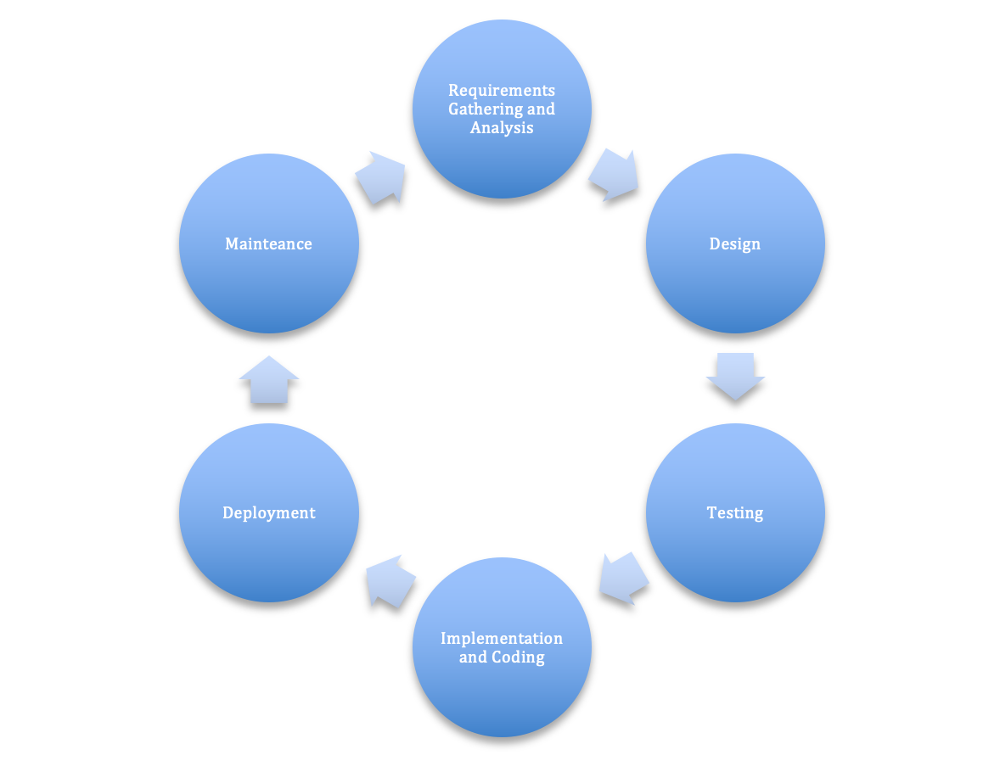

# Agile Process Evaluation and Improvement

Like the software development lifecycle and the Agile methodology themselves, the development of Agile scrum teams is an iterative process. Making 
adjustments after evaluating what is working and what is not working is as important for the team as it is for the software that they are developing. 

The evaluation of what is working and not working occurs during the maintenance phase. At this point in the cycle, the product has been through all of 
the other phases (from requirements gathering to testing) and has been deployed into production. Teams now monitor their products to ensure that the product 
meets the customer requirements established in the requirements gathering and analysis phase, fix software bugs that might have been missed during testing, 
and look for areas that could benefit from performance enhancements. As teams progress through the maintenance phase, they focus not only on fixing problems 
but also on preventing problems from recurring in the future. 
