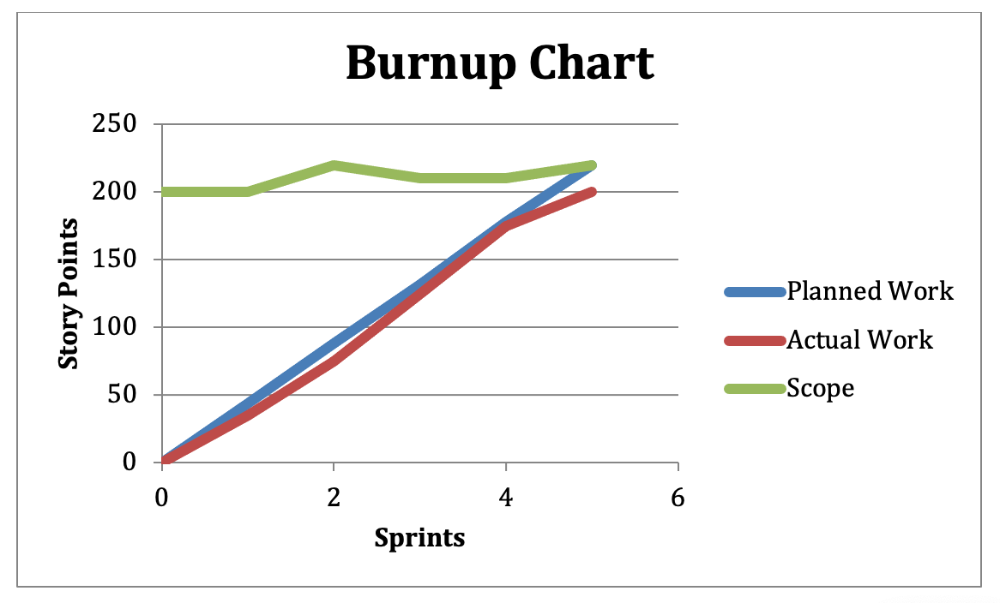

# Burn Up

Rather than showing the amount of work remaining in a project like a sprint or release burn down, a burn up chart shows the amount of work completed. To illustrate this, the burn up chart contains a line that climbs as work gets completed, in contrast to the burn down chart that shows a line that declines as the work is completed.

A reference line at the top of the burn up chart shows the scope of work for the project. The reference line rises work is added to the scope of the release and falls as work is removed.  

The following is an example of a burn up chart.

