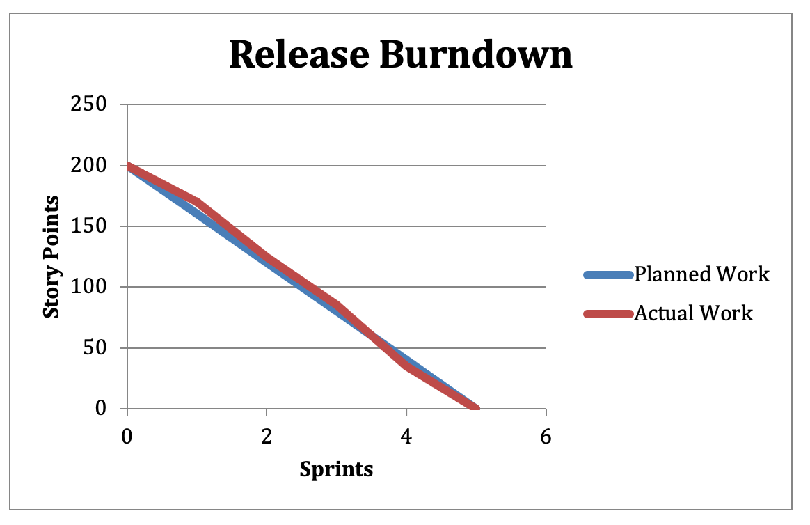

# Release Burn Down

If you have larger project that will be released after multiple sprints, you may want to track it using a release burn down chart. It functions 
the same as a sprint burndown chart, except that it indicates the number of story points remaining to be completed at the end of each sprint within a given release.

If your project contains five sprints, you release burndown might look like the following:

